# Notion → AI Research Pipeline

Automates the full research workflow for crypto projects stored in a **Notion** CRM or Cards Database:

1. Detect a card whose "Due-Diligence Questionnaire" (DDQ) child-page has been marked as **Completed**.
2. Generate an in-depth Markdown report via the multi-step *Deep Research* agent (web scraping + LLM).
3. Publish/overwrite a child page called **"AI Deep Research Report"** directly under the Notion card.
4. Run an LLM-based scoring function to rate the project and save the JSON answers.
5. Publish a 🔥 **Ratings** inline database with nested cards to relay project scores and Q&A, also for analysts to consult, chime in on Notion.

All steps run entirely server-less – schedule `python main.py` on a cron / GitHub Actions and you are done.

---

## 🖼️ Pipeline Overview

```mermaid
flowchart TD
    A[watcher.py poll Notion DB] -->|Completed DDQ| B[research.py deep-web research]
    B --> C[writer.py create/overwrite report page]
    C --> D[scorer.py LLM JSON scoring]
    D --> E[pusher.py update 🔥 Ratings DB]
```



Every module can be executed independently (useful during development) yet `main.py` stitches them together for weekly automation.

---

## 🗄️ Repo Layout

```
.
├── src/                # Runtime modules (watcher, research, writer, scorer, pusher)
├── web_research/       # Deep-research agent & async search/scrape stack
├── tests/              # Pytest suite covering the whole flow
├── main.py             # Orchestrator (weekly cron job)
├── requirements.txt    # Pinned dependencies
└── README.md           # ← you are here
```

---

## ⚡ Quick Start

### 1. Clone & enter
```bash
git clone https://github.com/Liscivia/AI_intern.git
cd AI_intern
```

### 2. Create a virtual environment (Python 3.11)
**Windows PowerShell**
```powershell
python -m venv ai_intern
.\ai_intern\Scripts\Activate.ps1
```
**macOS / Linux**
```bash
python3 -m venv ai_intern
source ai_intern/bin/activate
```

### 3. Install dependencies
```bash
pip install --upgrade pip
pip install -r requirements.txt
# Playwright needs browser binaries once
playwright install
```

### 4. Environment variables
Create the `.env` file, using the `.env.example` as reference:
```dotenv
# Notion
NOTION_TOKEN=secret_…
NOTION_DB_ID=<database-id> # enable automation on the notion CRM itself 

# LLM provider
OPENAI_API_KEY=sk-…
OPENAI_MODEL=gpt-4o-mini    # or any compatible model (deep-thinking & strong tool-calling capabilities recommended)

# Web-scraping
#   "firecrawl" (API-based) is default – set key or flip to Playwright fallback.
FIRECRAWL_API_KEY=fc_…       # recommended
DEFAULT_SCRAPER=firecrawl    # or playwright_ddgs

# Prompts
DEEP_RESEARCH_PROMPT="You are…"
```

### 5. Run the pipeline once
```bash
python main.py
```
Or execute the full test that mirrors the cron job:
```bash
pytest tests/test_final.py -q
```
or execute any of the tests to check out the functioning of each components
```bash
pytest tests/test_watcher.py -v -s
```

---

## 📝 Logs

File | Purpose
---- | -------
`logs/watcher.log` | Notion polling & pagination
`logs/research.log` | Deep-research orchestration & web searches
`logs/writer.log` | Markdown → Notion block conversion
`logs/scorer.log` | LLM scoring lifecycle

Each line is written in `key=value` format so you can grep/filter easily.

---

## 🪄 Troubleshooting

| Symptom | Fix |
| ------- | --- |
| `RuntimeError: Environment variable NOTION_TOKEN is required.` | Load/define all required vars (`NOTION_TOKEN`, `NOTION_DB_ID`, `OPENAI_API_KEY`). |
| Firecrawl 429s / quota | Lower `RESEARCH_CONCURRENCY` env vars or set `DEFAULT_SCRAPER=playwright_ddgs`. |


